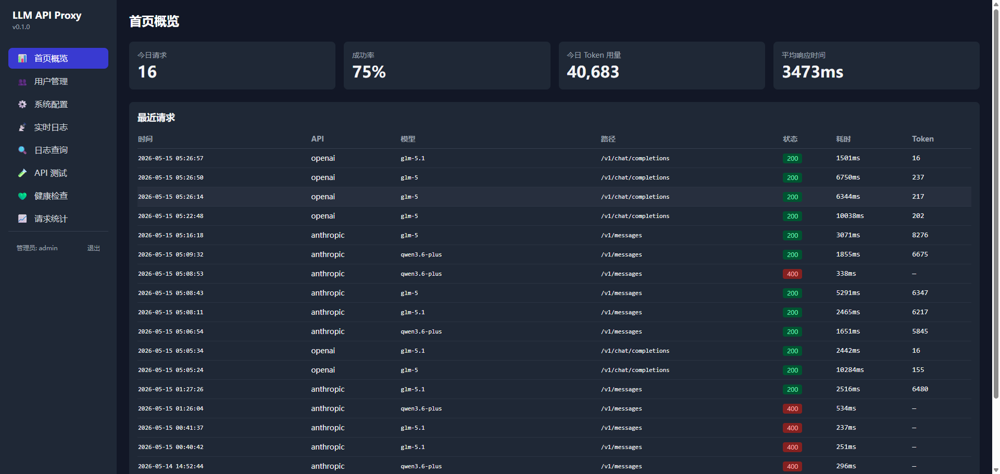
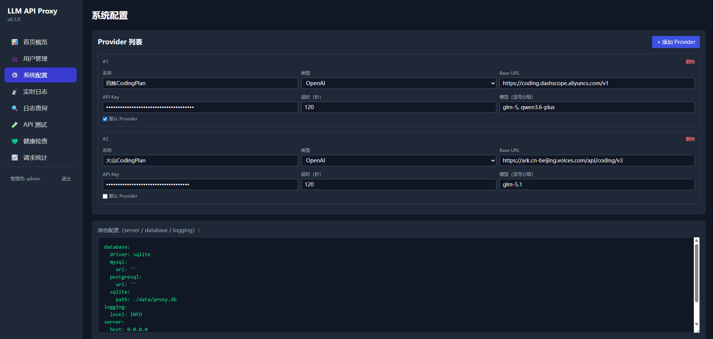
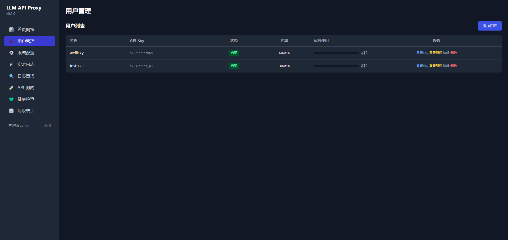
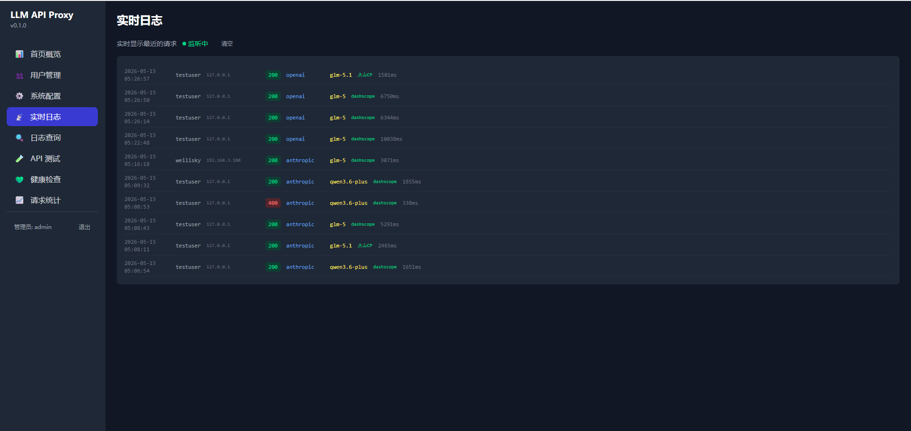
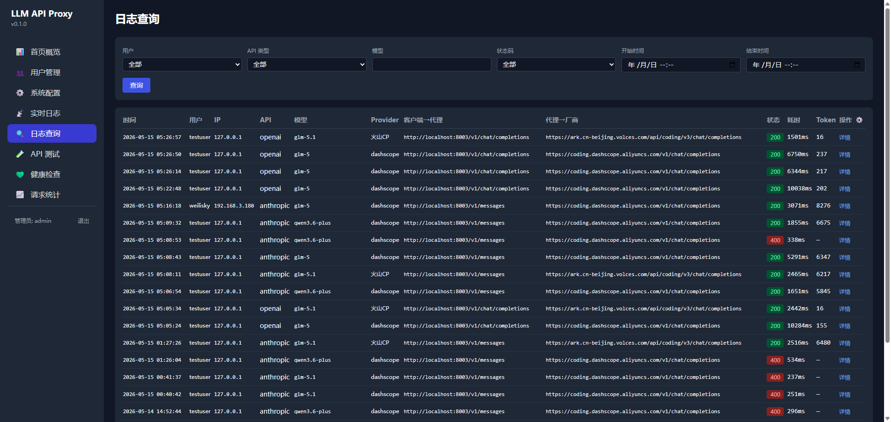

# LLM API Proxy 背景及使用场景说明

在AI编程普及的当下，开发者在日常工作中常面临多工具、多场景的AI交互需求，各类痛点逐渐凸显。为解决实际使用中的不便，提升AI交互的效率、可追溯性和便捷性，LLM API Proxy 应用应运而生。本工具以"轻量、实用、高效"为核心，聚焦开发者实际需求，弥补现有同类工具的短板，以下结合核心需求及延伸场景，详细说明工具的开发背景及适用场景。

## 一、核心开发背景（核心需求）

开发LLM API Proxy 的核心初衷，是解决开发者在使用各类AI编程工具过程中遇到的"分散、不便、冗余"等问题，具体源于以下4点核心需求：

1. **统一交互日志记录**：日常使用多种AI编程工具时，交互记录分散在各个工具中，无法集中管理，不利于后续的日志审计、问题追溯，以及基于历史交互内容搭建专属知识库，亟需一个统一的入口，记录每一次与AI的交互细节（包括请求内容、响应结果、交互时间等），实现交互数据的集中归档。

2. **AI交互内容可分析**：希望通过对各类AI编程工具与AI的交互内容进行集中梳理，深入分析工具的设计思路、交互逻辑，以及AI响应的侧重点，为自身优化开发效率、理解工具底层逻辑提供数据支撑，避免因交互记录分散导致的分析不便。

3. **内网AI编码需求**：部分工作场景中，内网机器受网络限制，无法直接访问外部大模型接口，需要一个代理服务部署在可联网的代理机上，实现内网机器通过该代理服务，顺畅使用大模型进行编码、调试等操作，打破网络限制。

4. **轻量便捷部署**：现有同类中转服务（如OneAPI）功能繁杂，部署流程繁琐，需要配置多种依赖、进行复杂的环境搭建，不适合追求高效、简洁部署的场景。亟需一个可直接打包为Windows下exe文件的工具，无需复杂配置，双击即可运行，降低部署门槛。

## 二、延伸使用场景（补充拓展）

基于核心需求延伸，LLM API Proxy 还可适配以下多种实用场景，进一步提升开发者的使用体验，覆盖更多工作场景需求：

1. **多账号统一管理**：当开发者同时使用多个大模型账号（如不同平台的API密钥）时，可通过本工具统一配置账号信息，无需在各个AI工具中分别切换账号，实现多账号的集中管控，减少账号切换的繁琐操作。

2. **交互内容过滤与脱敏**：针对部分敏感场景（如涉及公司内部代码、隐私信息的交互），可通过工具新增过滤规则，对交互内容中的敏感信息（如密钥、隐私数据、核心代码片段）进行自动脱敏，避免敏感信息泄露，满足合规要求。

3. **请求频率控制与限流**：部署代理服务后，可根据自身需求设置请求频率限制，避免因高频请求导致的API调用超限、费用激增，同时也能保护大模型接口，避免因过量请求导致的响应异常。

4. **离线交互记录查阅**：所有交互日志均本地或集中存储，支持离线查阅，即使在无网络环境下，也能随时调取历史交互记录，方便开发者回溯问题、复用交互内容（如重复使用相似的AI请求指令）。

5. **团队协作共享**：将工具部署在团队内部服务器上，团队成员可通过同一代理服务使用AI接口，同时共享交互日志，便于团队内同步AI使用情况、交流交互经验，提升团队整体开发效率。

6. **自定义响应格式**：针对不同的开发需求，可通过工具自定义AI响应的输出格式（如简化响应内容、提取核心信息、转换格式等），避免冗余信息干扰，让AI响应更贴合自身使用习惯。

7. **故障快速排查**：当AI交互出现异常（如响应失败、接口报错）时，可通过工具的统一日志，快速定位问题根源（如请求参数错误、接口连接异常、账号权限问题等），无需在多个工具中逐一排查，提升故障排查效率。

## 三、工具核心价值总结

LLM API Proxy 摒弃了同类工具的冗余功能，聚焦"统一、便捷、实用"三大核心，既解决了开发者多工具交互记录分散、内网无法访问大模型、部署繁琐等核心痛点，又通过延伸场景覆盖团队协作、合规脱敏、故障排查等需求，为开发者提供一站式的AI交互代理解决方案，适用于个人开发、小型团队等多种场景，助力提升AI编程效率，降低使用门槛。

---

## 四、使用说明

### 4.1 启动服务

#### 方式一：双击 EXE 文件启动（推荐）

1. 将 `llm-api-proxy.exe` 放置到一个空目录中，例如 `D:\llm-proxy\`
2. 双击 `llm-api-proxy.exe`，程序自动完成以下操作：
   - 首次启动时，自动在当前目录生成 `config.yaml` 配置文件
   - 自动创建 `data\` 目录并初始化 `proxy.db` 数据库
3. 启动完成后，浏览器访问 `http://localhost:8000/admin/login` 进入管理后台

```
D:\llm-proxy\
├── llm-api-proxy.exe     ← 双击此文件启动
├── config.yaml           ← 首次启动自动生成，可手动编辑
└── data\
    └── proxy.db          ← SQLite 数据库
```

#### 方式二：命令行启动

在 exe 所在目录打开命令行（Shift + 右键 → "在此处打开终端"），直接运行：

```cmd
llm-api-proxy.exe
```

或指定端口：

```cmd
set PROXY_PORT=9000
llm-api-proxy.exe
```

#### 方式三：源码启动（开发者）

```bash
pip install -r requirements.txt
uvicorn app.main:app --host 0.0.0.0 --port 8000
```

### 4.2 首次登录

1. 浏览器打开 `http://localhost:8000/admin/login`
2. 使用默认管理员账号登录：
   - 用户名：`admin`
   - 密码：`admin123`
3. 登录后可在管理后台修改密码



### 4.3 配置上游模型 Provider

1. 登录管理后台后，点击左侧菜单 **"系统配置"**
2. 在 Provider 卡片区域，配置你的上游模型信息：
   - **名称**：Provider 的标识名（如 `百炼CodingPlan`）
   - **协议**：选择 `OpenAI` 或 `Anthropic`
   - **API Key**：上游平台的 API 密钥
   - **Base URL**：上游 API 地址
   - **超时时间**：请求超时（秒）
   - **支持模型**：逗号分隔的模型列表，用于路由匹配
   - **默认**：勾选后作为无匹配时的兜底 Provider
3. 支持添加多个 Provider，按模型名自动路由
4. 编辑完成后点击 **"保存配置"**，系统自动热重载生效



#### Provider 路由规则

请求到达后，系统按以下优先级选择上游 Provider：

1. **精确匹配** — 模型名完全等于某个 Provider 的模型列表
2. **前缀匹配** — 模型名以某个 Provider 的模型列表项为前缀（如 `glm-` 匹配 `glm-5`）
3. **默认 Provider** — 选择标记为 `default` 的 Provider
4. **兜底** — 返回列表中的第一个 Provider

#### 配置示例

```yaml
upstream:
  providers:
    - name: "百炼CodingPlan"
      provider: "openai"
      api_key: "sk-sp-xxxx"
      base_url: "https://coding.dashscope.aliyuncs.com/v1"
      timeout: 120
      models: ["glm-5", "qwen3.6-plus", "qwen-"]
      default: true
    - name: "火山CP"
      provider: "openai"
      api_key: "your-key"
      base_url: "https://ark.cn-beijing.volces.com/api/v3"
      timeout: 120
      models: ["doubao-seed-1-6-250615"]
      default: false
```

### 4.4 创建用户

1. 点击左侧菜单 **"用户管理"**
2. 点击 **"添加用户"**，填写：
   - **名称**：用户标识
   - **速率限制**：每分钟最大请求数（默认 60）
   - **每日配额**：每日最大 token 用量（默认 0 为不限）
3. 创建成功后，系统自动生成 API Key（`sk-` 开头）
4. 将此 Key 配置到 AI 工具的认证信息中



#### 用户管理操作

- **启用/禁用**：一键开关，禁用后该 Key 无法请求
- **重置 Key**：生成新的 API Key，旧 Key 失效
- **重置配额**：清除今日已用 token，立即恢复额度
- **删除**：永久删除用户及其所有数据

### 4.5 AI 开发工具接入

代理兼容 OpenAI 和 Anthropic 两种协议，所有主流 AI 开发工具均可无缝接入。

| 工具 | 协议 | API Key 字段 | Base URL 字段 |
|------|------|-------------|--------------|
| Claude Code | Anthropic | `ANTHROPIC_API_KEY` | `ANTHROPIC_BASE_URL` |
| OpenCode | OpenAI | `OPENAI_API_KEY` | `OPENAI_BASE_URL` |
| Trae | OpenAI | API Key | Base URL + `/v1` |
| Cursor | OpenAI | API Key | API Endpoint |
| Continue | OpenAI | `apiKey` | `apiBase` |

**Key 统一**：所有工具使用同一个 Key — 通过管理后台 `/admin/users` 创建的用户 API Key（`sk-` 开头）。

#### Claude Code 配置

```bash
# 方式一：环境变量
export ANTHROPIC_BASE_URL=http://localhost:8000
export ANTHROPIC_API_KEY=sk-xxxx...

# 方式二：.claude/settings.json
{
  "env": {
    "ANTHROPIC_BASE_URL": "http://localhost:8000",
    "ANTHROPIC_API_KEY": "sk-xxxx..."
  }
}
```

#### OpenCode 配置

```bash
export OPENAI_API_KEY=sk-xxxx...
export OPENAI_BASE_URL=http://localhost:8000/v1
```

#### Trae 配置

1. 打开 Trae 设置 → AI 模型 → 自定义模型
2. 选择 "OpenAI Compatible" 模式
3. 填写：
   - **API Key**: `sk-xxxx...`
   - **Base URL**: `http://localhost:8000/v1`
   - **Model Name**: 你的 Provider 支持的模型名

#### 命令行调用

```bash
# OpenAI 格式
curl http://localhost:8000/v1/chat/completions \
  -H "Content-Type: application/json" \
  -H "Authorization: Bearer sk-xxxx..." \
  -d '{"model":"glm-5","messages":[{"role":"user","content":"Hello"}],"max_tokens":1000}'

# Anthropic 格式
curl http://localhost:8000/v1/messages \
  -H "Content-Type: application/json" \
  -H "anthropic-version: 2023-06-01" \
  -H "Authorization: Bearer sk-xxxx..." \
  -d '{"model":"glm-5","messages":[{"role":"user","content":"Hello"}],"max_tokens":1000}'
```

### 4.6 查看日志

#### 实时日志

点击左侧菜单 **"实时日志"**，SSE 推送实时显示最近的请求，包含用户、IP、状态码、API 类型、模型、Provider 和耗时信息。



#### 日志查询

点击左侧菜单 **"日志查询"**，支持：
- **分页查询**：每页可设置条数
- **按用户过滤**：选择特定用户的请求
- **按 API 类型过滤**：OpenAI / Anthropic
- **按模型名称搜索**
- **按状态码筛选**：200 / 400 / 404 / 500
- **按时间范围查询**：开始时间 + 结束时间
- **列可见性控制**：点击表头右侧 ⚙ 按钮，自定义显示/隐藏列，选择自动保存到本地



### 4.7 配置文件说明

配置文件 `config.yaml` 位于 **exe 同级目录**（首次启动自动生成），可直接编辑：

```yaml
database:
  driver: sqlite
  sqlite:
    path: ./data/proxy.db       # 相对于 exe 所在目录
server:
  host: 0.0.0.0                  # 监听地址
  port: 8000                     # 监听端口
  workers: 1
upstream:
  providers:                     # 上游模型 Provider 列表
    - name: "dashscope"
      provider: "openai"         # openai | anthropic
      api_key: "sk-xxxx"
      base_url: "https://coding.dashscope.aliyuncs.com/v1"
      timeout: 120
      models: ["glm-5", "qwen3.6-plus"]
      default: true
logging:
  level: INFO                    # 日志级别：DEBUG | INFO | WARNING | ERROR
```

修改 `config.yaml` 后，重启服务即可生效。也可以通过管理后台的"系统配置"页面编辑并保存，系统自动热重载。

### 4.8 端口及环境变量

| 环境变量 | 说明 | 默认值 |
|---------|------|-------|
| `PROXY_HOST` | 监听地址 | `0.0.0.0` |
| `PROXY_PORT` | 监听端口 | `8000` |
| `DATABASE_SQLITE_PATH` | SQLite 数据库路径 | `./data/proxy.db` |
| `LOGGING_LEVEL` | 日志级别 | `INFO` |

### 4.9 防火墙配置

如果其他设备需要访问代理服务，请在 Windows 防火墙中放行对应端口：

```cmd
netsh advfirewall firewall add rule name="LLM API Proxy" dir=in action=allow protocol=TCP localport=8000
```
